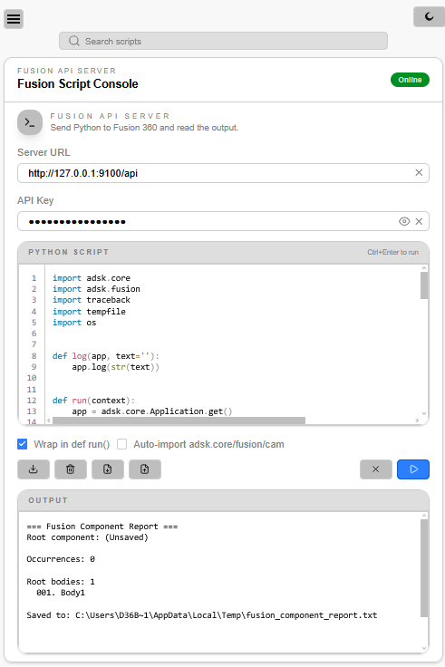

# Fusion Script Console **Python + Svelte 5 + TypeScript + TailwindCSS**
<!-- markdownlint-disable MD033 -->
Fusion 360 add-in with a local HTTP API server and a Svelte-based UI for running Python scripts.  
It includes start/stop controls, real-time server status, and local script storage with named entries and single-file export.

- Local HTTP API endpoints: `/api`, `/health`
- Palette UI with editor, output, and server status
- Script storage in `localStorage` with save/load/export
- Token-based API protection

---

<p align="center">
  
</p>

---

<details>
  <summary><h2>Table of Contents</h2></summary>

- [Fusion Script Console **Python + Svelte 5 + TypeScript + TailwindCSS**](#fusion-script-console-python--svelte-5--typescript--tailwindcss)
  - [Overview](#overview)
  - [Quick Start](#quick-start)
    - [1. Clone the repository](#1-clone-the-repository)
    - [2. Add the add-in to Fusion 360](#2-add-the-add-in-to-fusion-360)
    - [3. Run the add-in](#3-run-the-add-in)
    - [4. Open the `web` folder](#4-open-the-web-folder)
    - [5. Install dependencies](#5-install-dependencies)
    - [6. Build the web app](#6-build-the-web-app)
    - [7. Start the local preview server](#7-start-the-local-preview-server)
    - [8. Open the app in your browser](#8-open-the-app-in-your-browser)
    - [9. Enter the API key](#9-enter-the-api-key)
  - [Features](#features)
  - [UI](#ui)
  - [API Key](#api-key)
  - [Credits](#credits)
  - [License](#license)

</details>

## Overview

This project combines a Python add-in for Fusion 360 with a Svelte 5 frontend.

The add-in starts a local HTTP API server and executes commands safely through a `TaskManager`.  
The web UI provides an editor, output panel, and controls for running and managing scripts from the Fusion palette.

## Quick Start

### 1. Clone the repository

```bash
git clone https://github.com/MaestroFusion360/FusionScriptConsole.git
```

### 2. Add the add-in to Fusion 360

In Fusion 360:

- press **Shift + S**
- choose **Script or Add-In from Device**
- select the add-in folder from this repository

### 3. Run the add-in

Start the add-in in Fusion 360.

If everything is working correctly, you should see:

```text
Fusion API server started at http://127.0.0.1:9100
```

### 4. Open the `web` folder

```bash
cd web
```

### 5. Install dependencies

```bash
npm install
```

### 6. Build the web app

```bash
npm run build
```

### 7. Start the local preview server

Default port: **4173**

```bash
npm run preview
```

### 8. Open the app in your browser

```text
http://127.0.0.1:4173/
```

### 9. Enter the API key

Use the API key defined in your `.env` file.

Example:

```text
12345abcdef67890
```

## Features

- Local HTTP API server with `/api` and `/health` endpoints
- Start/stop server controls inside Fusion 360
- Live server status in the UI
- Script storage with names, loading, deletion, and export
- Simple editor/output workflow for running Python scripts

## UI

The palette UI includes:

- code editor
- output panel
- run controls
- save/delete dialog for stored scripts

## API Key

The server listens only on `127.0.0.1`.

- `/api` requires an API key
- `/health` is always available for status checks

Set the key in `.env`:

```env
FUSION_API_SERVER_KEY=YOUR_KEY
```

Then:

1. Restart Fusion 360 or reload the add-in
2. Enter the same key in the UI field **API Key**

If the key does not match, the server returns:

```text
401 Unauthorized
```

## Credits

This add-in is based on Autodesk's **FusionMCPSample** project.

- [FusionMCPSample repository](https://github.com/AutodeskFusion360/FusionMCPSample)
- [FusionMCPSample license](https://github.com/AutodeskFusion360/FusionMCPSample/blob/main/LICENSE)

`FusionMCPSample` is a Fusion add-in that exposes an HTTP API for Model Context Protocol (MCP) communication, allowing external tools and AI assistants to interact with Fusion through a secure local interface.

## License

MIT License. See [LICENSE](LICENSE.md) for details.

---

<p align="center">
  <a href="https://github.com/MaestroFusion360/FusionScriptConsole/issues">
    
  </a>
  <a href="https://github.com/MaestroFusion360/FusionScriptConsole/stargazers">
    
  </a>
</p>

<p align="center">
  
</p>
